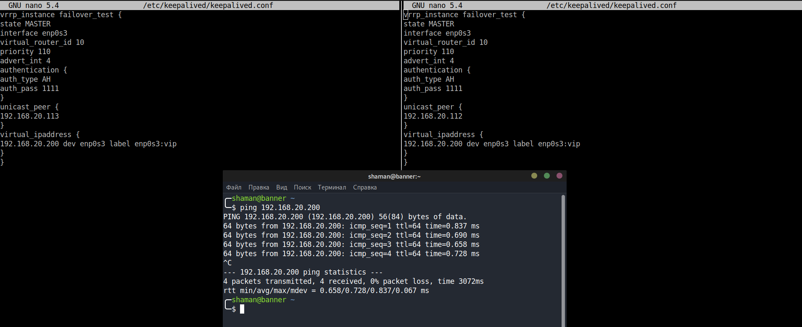
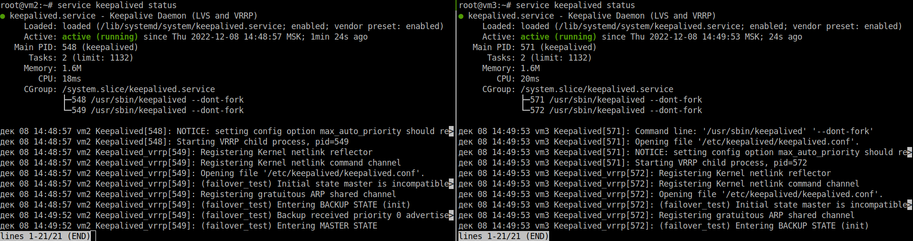

# Домашнее задание к занятию "`Keepalived/vrrp.`" - `Живарев Игорь`


### Задание 1

Поле для вставки кода...

vrrp_instance failover_test {
state MASTER
interface enp0s3
virtual_router_id 10
priority 110
advert_int 4
authentication {
auth_type AH
auth_pass 1111
}
unicast_peer {
192.168.20.112
}
virtual_ipaddress {
192.168.20.200 dev enp0s3 label enp0s3:vip
}
}

```





---

